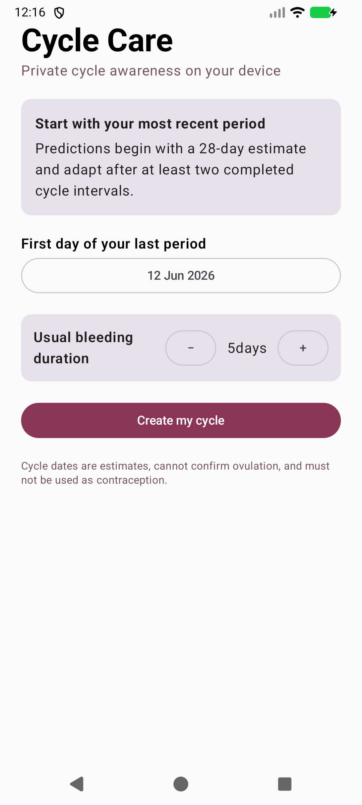
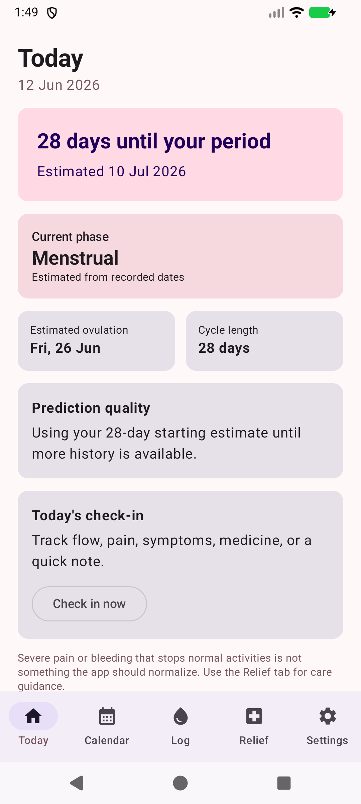
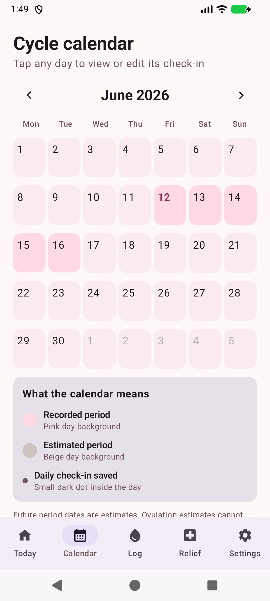

# Cycle Care

Cycle Care is a private, local-first Android menstrual cycle tracker built with Kotlin and Jetpack Compose. It estimates upcoming cycle phases, records daily symptoms, and keeps health data on the device.

## Screenshots

<p align="center">
  
  
  
</p>

## Features

- Starts with a 28-day estimate, adapts to recent cycles, and flags overdue periods without inventing unrecorded cycles.
- Shows recorded and estimated period days in a navigable month calendar with check-in history.
- Records and edits bleeding, pain, symptoms, medicine use, and notes locally with Room.
- Schedules period and optional phase reminders with WorkManager.
- Provides adult-focused home-care guidance and safety-gated OTC medicine information.
- Stores settings with DataStore and requires no account or cloud service.

## Tech Stack

- Kotlin and Jetpack Compose with Material 3
- Room for cycle history and symptom logs
- DataStore for preferences
- WorkManager for local reminders
- Navigation Compose for the five main app sections
- JUnit and Compose UI testing

## Getting Started

1. Clone the repository.
2. Open it in Android Studio.
3. Let Gradle sync and run the `app` configuration on an Android 8.0 (API 26) or newer device.

You can also build and test from the command line:

```shell
./gradlew testDebugUnitTest assembleDebug
```

The debug APK is generated at `app/build/outputs/apk/debug/app-debug.apk`.

## Privacy and Health Notice

Cycle Care stores cycle information locally on the device. Predictions are for cycle awareness only: they cannot confirm ovulation and must not be used as contraception. Health guidance is educational and does not replace advice from a clinician or pharmacist.
